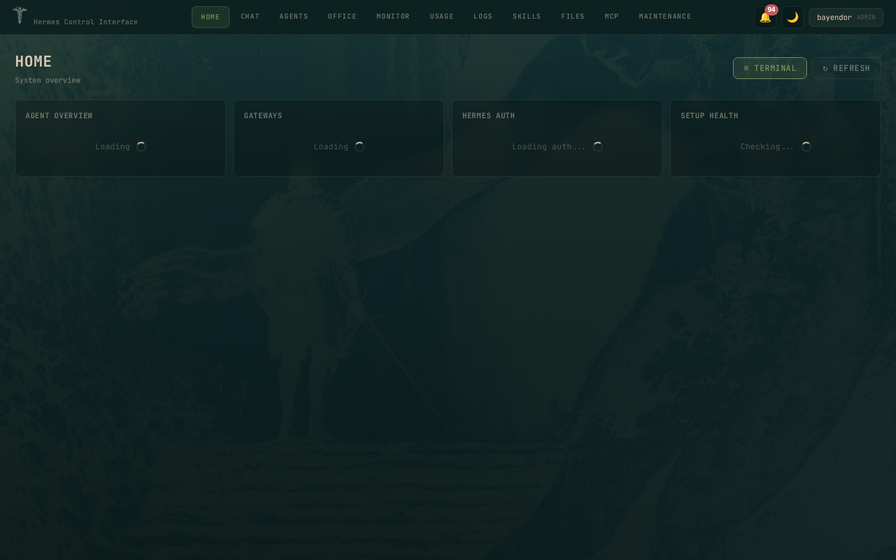
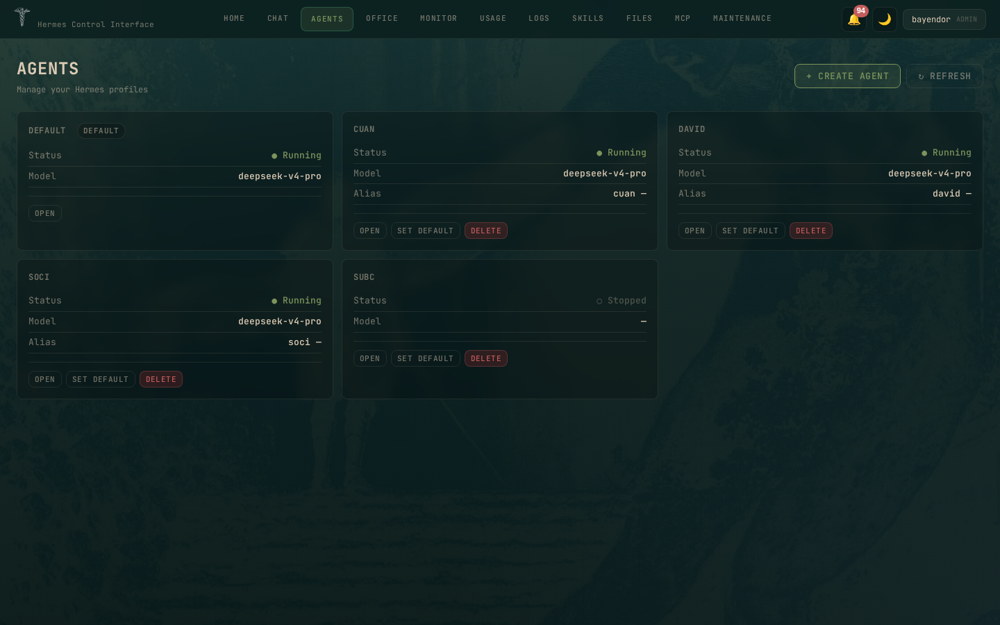
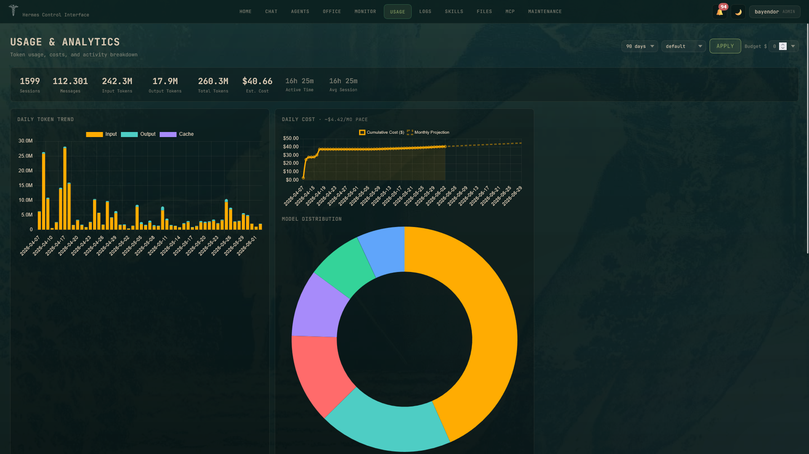
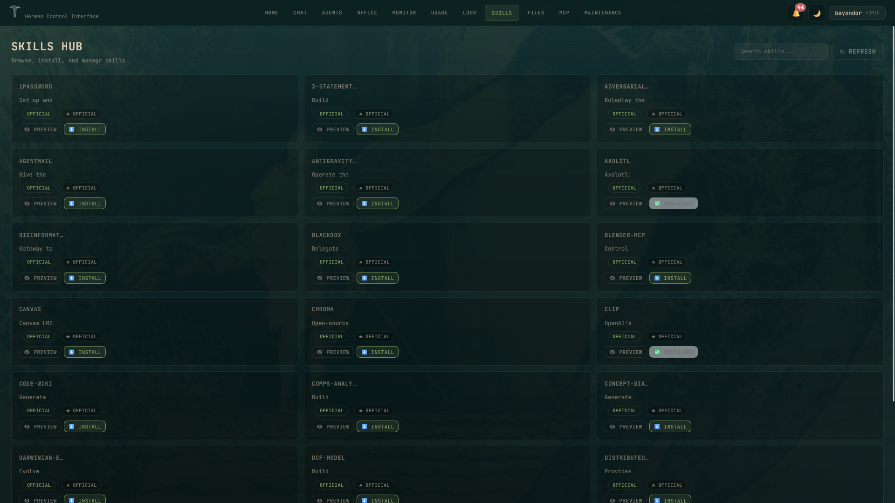
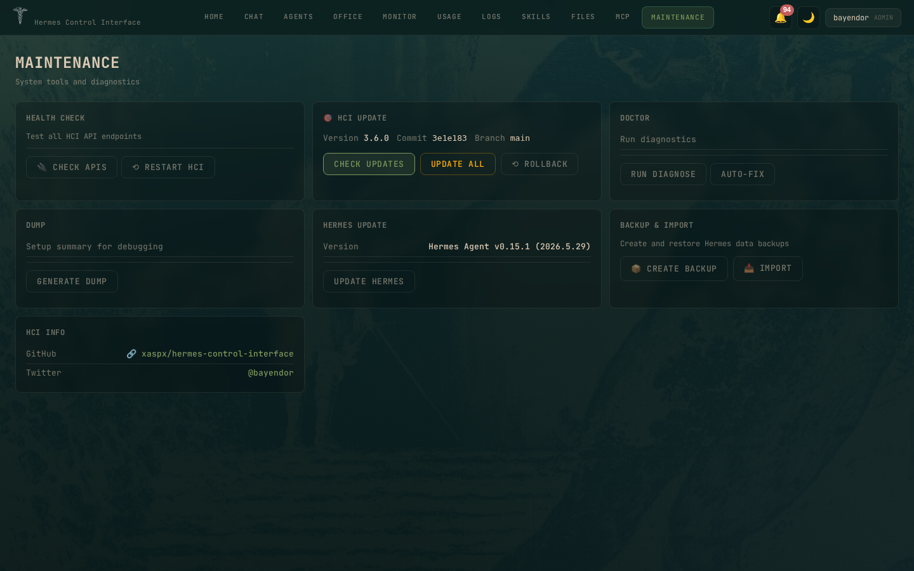
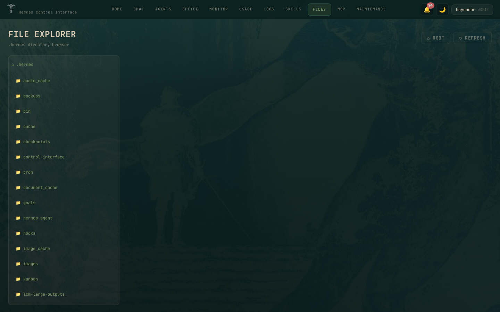
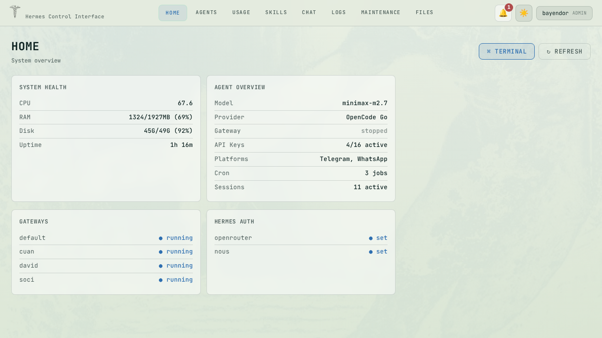
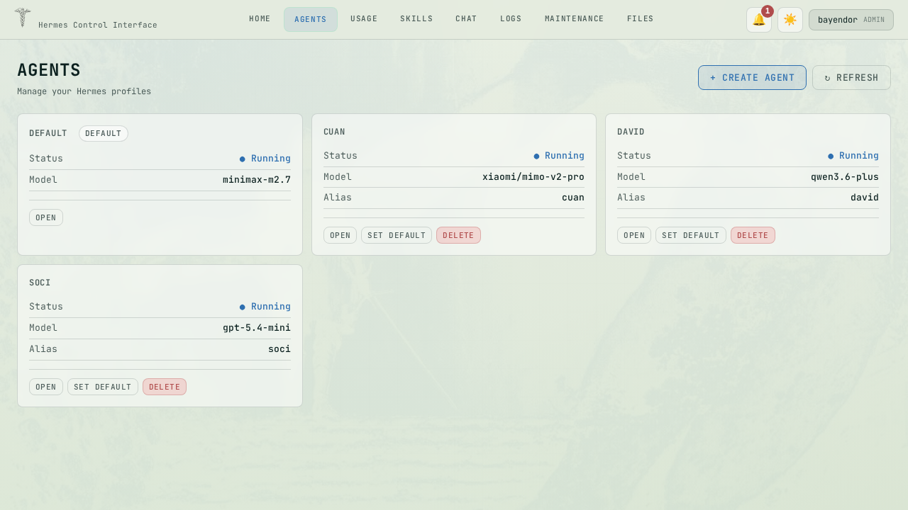
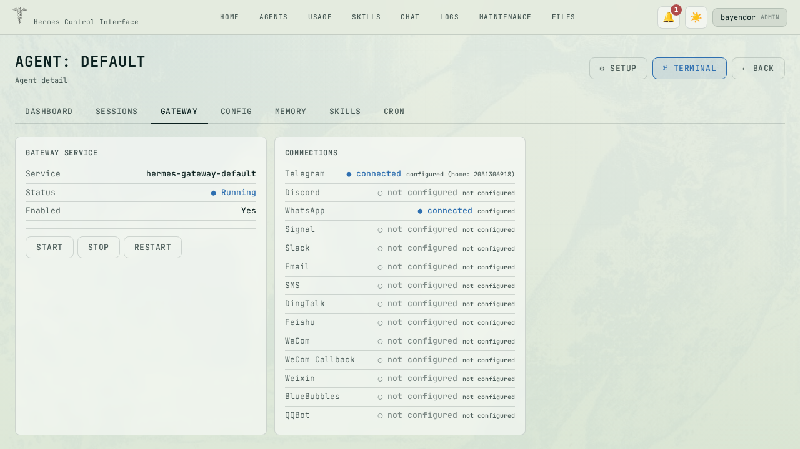
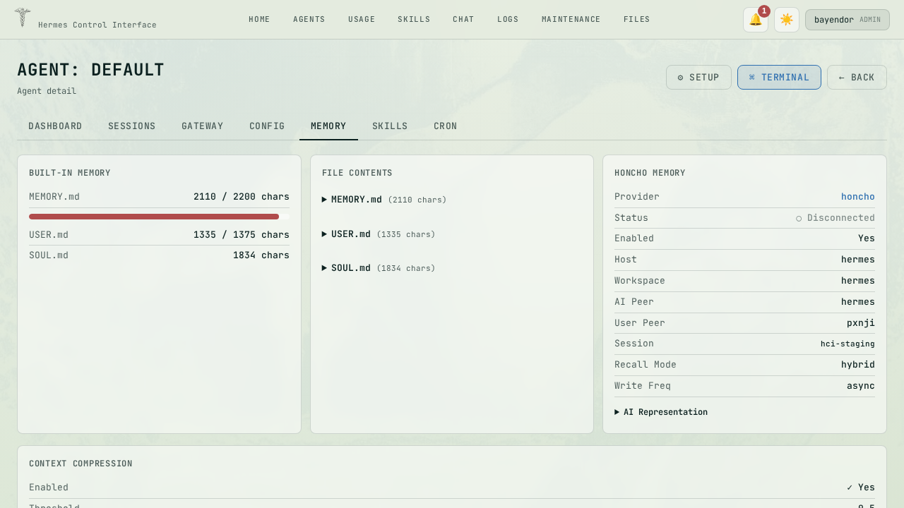

# Hermes Control Interface

A self-hosted web dashboard for the [Hermes AI agent](https://github.com/NousResearch/hermes-agent) stack. Browser-based terminal, file explorer, session management, cron scheduling, token analytics, and multi-agent administration — all behind a password gate.

**Stack:** Vanilla JS + Vite · Node.js · Express · WebSocket · xterm.js
**Version:** 3.3.0

---

## Screenshots

### Dark Mode

| Home | Agents | Usage & Analytics |
|------|--------|-------------------|
|  |  |  |

| Skills Hub | Maintenance | File Explorer |
|------------|-------------|---------------|
|  |  |  |

| Agent Dashboard | Gateway & Connections | Memory & Honcho |
|-----------------|----------------------|-----------------|
|  |  |  |

| Agent Skills | Cron Jobs |
|--------------|-----------|
|  |  |

### Light Mode

| Home | Agents | Skills Hub |
|------|--------|------------|
|  |  |  |

| Gateway | Memory |
|---------|--------|
|  |  |

---

## Features

### 7 Pages

**Home** — System overview dashboard:
- System Health: CPU, RAM, Disk, Uptime
- Agent Overview: model, provider, gateway status, API keys, platforms
- Gateways: per-profile running/stopped status
- Token Usage (7d): sessions, messages, tokens, cost, models, platforms, top tools

**Agents** — Multi-agent management:
- List all Hermes profiles with status and model
- Create, clone, delete, set default
- Gateway start/stop per profile

**Agent Detail** — Per-agent management with 6 tabs:
- **Dashboard**: Identity, gateway service, token usage
- **Sessions**: List, search, rename, delete, export, resume in CLI
- **Gateway**: Start/stop/restart, real-time logs, systemd service management
- **Config**: 13 categories, 80+ settings, structured form + raw YAML editor
- **Memory**: Dynamic provider panel (built-in MEMORY.md, honcho, external)
- **Cron**: List/create/pause/resume/run/remove jobs with schedule presets

**Usage & Analytics** — Full token breakdown:
- Time range filter: Today, 7d, 30d, 90d
- Agent filter: per-profile or all
- Overview: sessions, messages, tokens, cost, active time
- Models: per-model sessions and tokens
- Platforms: per-platform breakdown (CLI, Telegram, WhatsApp, etc.)
- Top Tools: most used tools with call counts

**Skills Marketplace** — Installed skills browser:
- List all installed skills grouped by category
- Shows source (builtin/local) and trust level
- Search and filter

**Maintenance** — System administration:
- Doctor: run diagnostics, auto-fix issues
- Dump: generate debug summary
- Update: Hermes agent version update
- Backup & Import: download/restore Hermes data as zip
- HCI Restart: restart the Control Interface from UI
- Users: create/delete users, role management
- Auth: provider status (OpenRouter, Nous Portal, etc.)
- Audit: timestamped activity log

**File Explorer** — Split-view file editor:
- Directory tree browser (left panel)
- Text editor with save (right panel)
- Secure: paths scoped to ~/.hermes, traversal prevented

### Terminal

- Real PTY shell via node-pty + xterm.js over WebSocket
- Touch controls (↑↓␣↵) for mobile
- Fullscreen toggle
- Auto-cleanup flow: Ctrl+C → clear → command

### Notifications

- Bell icon with unread count badge (top-right)
- Dropdown panel with dismiss/clear
- Sources: system alerts (disk/RAM/CPU), gateway events, session CRUD, user management
- Persistent: ~/.hermes/hci-notifications.json

### Theme

- **Dark mode**: `#0b201f` background, `#dccbb5` foreground, `#7c945c` accent
- **Light mode**: `#e4ebdf` background, `#0b201f` foreground, `#2e6fb0` accent
- Toggle via header button, persisted in localStorage
- Login background image with overlay

### Security

- Multi-user auth: admin + viewer roles
- bcrypt password hashing
- CSRF tokens on all mutating requests
- Conditional Secure cookie flag (auto-detects HTTPS)
- WebSocket origin verification
- Input sanitization: strict regex on all user inputs (profiles, sessions, titles)
- Path traversal prevention
- Rate limiting on login (5 failed/15min)
- unhandledRejection + uncaughtException handlers

---

## Quick Start

```bash
# Clone
git clone https://github.com/xaspx/hermes-control-interface.git
cd hermes-control-interface

# Install
npm install

# Configure
cp .env.example .env
# Edit .env:
#   HERMES_CONTROL_PASSWORD=your-password
#   HERMES_CONTROL_SECRET=your-secret

# Build frontend
npx vite build

# Start
npm start
```

Access at `http://localhost:10272` (default PORT).

## Environment Variables

| Variable | Required | Description |
|---|---|---|
| `HERMES_CONTROL_PASSWORD` | Yes | Login password |
| `HERMES_CONTROL_SECRET` | Yes | CSRF + internal auth secret |
| `PORT` | No | Server port (default: 10272) |
| `HERMES_CONTROL_HOME` | No | Hermes home dir (default: ~/.hermes) |
| `HERMES_CONTROL_ROOTS` | No | File explorer roots (JSON array) |
| `HERMES_PROJECTS_ROOT` | No | Projects directory |

## Architecture

```
src/                    # Vite source (ES modules)
├── index.html          # Entry point
├── js/main.js          # App logic (~2400 lines)
├── css/
│   ├── theme.css       # Color palette (dark/light)
│   ├── layout.css      # Topbar, modals, dropdowns
│   └── components.css  # Cards, tables, forms, editor, file explorer
└── assets/             # SVG icons

dist/                   # Vite build output (served by Express)
server.js               # Express + WebSocket + PTY + API (~2300 lines)
auth.js                 # Multi-user auth system
```

## Development

```bash
# Edit source in src/
# Build
npx vite build
# Restart (never in foreground — use detached)
kill $(lsof -t -i:10274) 2>/dev/null; sleep 1; nohup node server.js &>/dev/null & disown
```

## API

60+ endpoints covering:
- Auth (login, logout, setup, users CRUD)
- Sessions (list, rename, delete, export)
- Profiles (list, create, delete, use, gateway control)
- Cron (list, create, pause, resume, run, remove)
- Config (read, write, YAML parsing)
- Memory (provider-specific panels)
- Skills (list, parse)
- Files (list, read, write, save)
- System (health, insights, usage, doctor, dump, update)
- Notifications (list, dismiss, clear)

See `docs/API.md` for full reference.

## Security Audit

Full audit: `docs/SECURITY_AUDIT.md`
Score: 7.0/10 — Production-ready with recommended fixes.

## Updating HCI

```bash
# 1. Pull latest code
cd /root/projects/hermes-control-interface  # or your install path
git pull origin main

# 2. Install dependencies (if package.json changed)
npm install

# 3. Rebuild frontend
npm run build

# 4. Restart production server
kill $(lsof -t -i :10272) 2>/dev/null
nohup node server.js &>/dev/null & disown
```

Or use the HCI UI: Maintenance → HCI Restart (restarts the server from the browser).

**Non-root users:** Replace `/root/projects` with your user's project directory.
If running via systemd, use `sudo systemctl restart hermes-control` instead of manual kill/restart.

## Changelog

### v3.3.0 (2026-04-17)
**Chat Revamp:**
- Hermes chat output format: auto-detect new `session_id:` and legacy `Session:` ID formats
- New chat: `--continue ""` (empty) creates fresh session vs bare `--continue` resumes last
- Tool call cards: collapsible tool calls with JSON viewer, collapsed by default
- Banner suppression: `-Q` flag passed to hermes for clean output
- Sidebar: model tag, session list, resume/new chat buttons

**User Management v2 (RBAC):**
- 28 permissions across 12 groups: Sessions, Chat, Logs, Usage, Gateway, Config, Secrets, Skills, Cron, Files, Terminal, Users, System
- Built-in roles: `admin` (full), `viewer` (read-only)
- Create/edit user modal: role presets, grouped permission checklist, reset password
- Permission gating on 9 previously-unprotected endpoints: `/api/chat/send`, `/api/chat`, `/api/cron`, `/api/terminal/exec`, `/api/usage`, `/api/profiles/use`, `/api/plugins`, `/api/agents/*/sessions`

**Security:**
- Security audit (docs/SECURITY_AUDIT.md) — score 7.0/10, 3 critical/medium issues found and fixed
- XSS fix: `loadHomeCards()` now escapes all dynamic values with `escapeHtml()`
- Rate limiter: terminal exec limited to 30 commands/minute per IP
- Token cleanup: proper `setInterval()` every 15 minutes (was only on creation)
- Admin-only gate: `GET /api/plugins` now requires `admin` role
- Full activity audit log in Maintenance → Audit panel

**Skills:**
- Check updates: handles "unavailable" source status gracefully
- Uninstall: uses stdin pipe (`echo y |`) instead of `--yes` flag

**UX & Bug Fixes:**
- Notification dismiss: backend handles both `/api/notifications/:id/dismiss` and `/api/notifications/dismiss`
- Sidebar: responsive CSS, `flex-shrink:0`, mobile breakpoints at 480px
- Agent dropdown: follows dark/light theme
- Favicon: moved to `public/` to prevent Vite hash mismatch causing 404 loop
- HCI Info panel in Maintenance: version, GitHub link, Twitter @bayendor link

### v3.2.0 (2026-04-14)
**Performance:**
- Insights speed: 60s+ timeout → 0.65s via IPv4 adapter on model_metadata.py
- Timeouts reduced: 10s → 5s (model metadata), 5s → 3s (llama.cpp props)

**Security:**
- WebSocket origin: exact match (was substring check)
- Body limit: 10MB → 1MB global, 10MB only on avatar upload
- Temp files: `crypto.randomUUID()` (predictable paths removed)
- Skills install/uninstall: `execHermes()` instead of shell interpolation
- Username validation: 2-32 chars, alphanumeric/_.- only

**Features:**
- Log tabs: Agent, Error, and Gateway logs now working
- Non-root user support: dynamic HCI identity, HOME-aware paths
- Gateway service: auto-detect `hermes-gateway-<profile>` for non-root

**Fixes:**
- Terminal flow: transcript handling after sendCommand
- XSS: 15+ escaped user-facing error messages
- Auth panel: data loaded async, doesn't block page load
- CPR stripping: removed ANSI escape from terminal
- Maintenance UI: added Backup & Import and HCI Restart buttons

### v3.1.0 (2026-04-12)
- Skills Hub + Honcho panel + Gateway connections
- HTTPS support

## License

MIT

## Credits

Built for the [Hermes Agent](https://github.com/NousResearch/hermes-agent) ecosystem.
