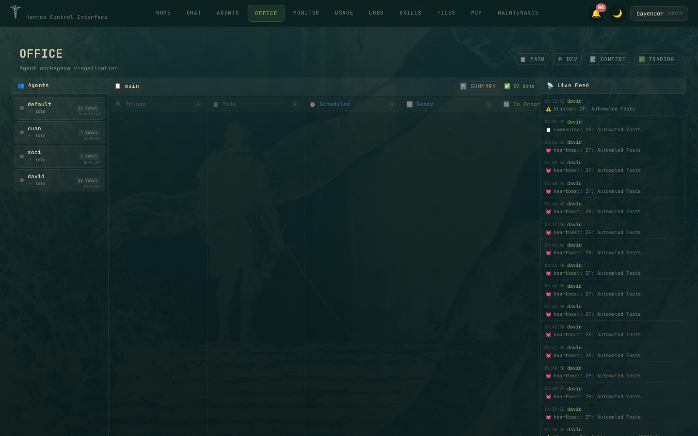
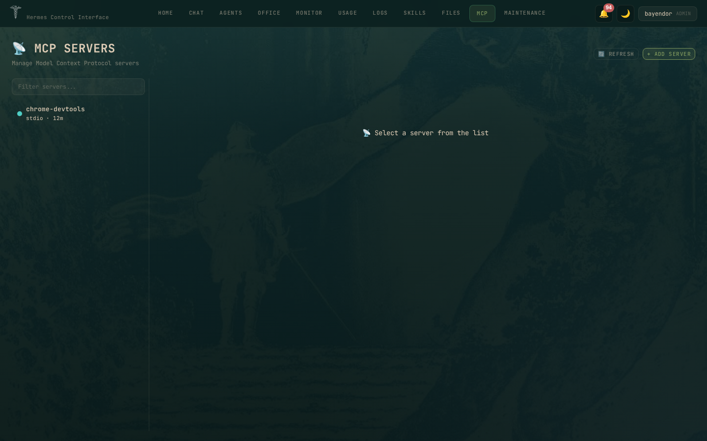

# Hermes Control Interface

A self-hosted web dashboard for the [Hermes AI agent](https://github.com/NousResearch/hermes-agent) stack. Manage agents, chat, terminals, files, cron, token analytics, MCP servers, and swarm pipelines — behind a password gate.

**Stack:** Vanilla JS + Vite · Node.js · Express · WebSocket · xterm.js · Chart.js · better-sqlite3  
**Version:** 3.6.0 · **License:** MIT

---

## Quick Start

```bash
git clone https://github.com/xaspx/hermes-control-interface.git
cd hermes-control-interface
cp .env.example .env     # set HERMES_CONTROL_PASSWORD + HERMES_CONTROL_SECRET
npm install && npm run build
node server.js            # → http://localhost:10274
```

See [docs/INSTALL.md](docs/INSTALL.md) for production setup, nginx, and systemd.

---

## Overview

| Page | What |
|------|------|
| **Home** | System health, agent overview, gateway status, token usage |
| **Chat** | Real-time streaming via gateway API, tool call cards, multi-profile |
| **Agents** | Profile CRUD, gateway lifecycle, per-agent dashboard/sessions/cron |
| **Office** | 3-panel swarm monitor — agent health, kanban pipeline, live feed |
| **Monitor** | Gateway logs, CPU/RAM metrics, live process view |
| **Usage** | Token analytics, daily trends, cost projections, budget alerts |
| **Logs** | Agent, error, and gateway logs with level filter |
| **Skills** | Browse, install, and remove Hermes skills |
| **Files** | Browse and edit files on the server |
| **MCP** | MCP server control plane — start, stop, restart, log tail, config editor |
| **Maintenance** | Backup, restore, HCI update, system doctor |

---

## Screenshots

### Core Pages · Dark Mode

| | | |
|-|-|-|
| Home | Chat | Office |
|  |  |  |
| Agents | MCP Manager | Usage |
|  |  |  |

### Agent Detail Pages

| | | |
|-|-|-|
| Dashboard | Sessions | Gateway |
|  |  |  |
| Config | Memory | Skills |
|  |  |  |

---

## Features

### Office v3 — ZOO Swarm Monitor

Three-panel dashboard with zero-subprocess agent states (~100ms vs 3000ms):

- **Agents Panel** — health grid via config.yaml + kanban.db
- **Kanban Panel** — 8 status lanes (triage→done), dependency arrows, board switcher
- **Live Feed** — 50 events from gateway logs, agent filter dropdown, keyword search
- **Task Popup** — expandable run history, workspace file browser, event enrichment, timeline, load-more

### Chat

- Real-time streaming via WebSocket gateway API
- Multi-profile support with profile switcher
- Tool call cards with collapsible JSON viewer
- Stop button, session resume, fork from message

### MCP Manager

Full operational control plane — list, start, stop, restart MCP servers. Live log tail and config editor from the browser. 11 REST API routes.

### Security

- CSP without `unsafe-eval`, CSRF on all mutating endpoints
- Rate limiting (global + chat), WebSocket RBAC
- Path traversal prevention, XSS protection
- 20 permissions across 3 roles (admin, viewer, custom)

### PWA

Installable to homescreen. Service worker with offline caching. Auto-update on new version.

---

## Architecture

```
Browser (11 pages, SPA)
       │
   HTTPS :10274
       │
   Express Server (server.js — 6.4K lines)
       ├── Auth (bcrypt, sessions, CSRF)
       ├── RBAC (20 permissions, 3 roles)
       ├── REST API (30+ routes)
       ├── WebSocket (real-time)
       │
       ├── Hermes CLI (agent states, gateway control)
       ├── SQLite (kanban.db — task pipeline)
       ├── Filesystem (config.yaml, logs, skills)
       └── External (MCP servers, token pricing)
```

Full architecture: [docs/ARCHITECTURE.md](docs/ARCHITECTURE.md)

---

## API

| Endpoint | Auth | Description |
|----------|------|-------------|
| `GET /api/office/kanban?board=` | Login | Kanban board with tasks + links |
| `GET /api/office/kanban/:id?board=` | Login | Task detail with runs, events, comments |
| `GET /api/office/kanban/:id/workspace-file?board=&path=` | Login | Read workspace files (code, logs) |
| `POST /api/office/kanban/:id/action?board=` | Login+CSRF | Quick actions (done, start, reopen, etc.) |
| `GET /api/office/agent-states` | Login | Agent health grid |
| `GET /api/office/events` | Admin | Live feed from gateway logs |
| `GET /api/office/summary?board=` | Login | Board stats + recommendations |

Full API: [docs/API.md](docs/API.md)

---

## Configuration

| Variable | Default | Description |
|----------|---------|-------------|
| `HERMES_CONTROL_PASSWORD` | — | Login password (bcrypt hashed) |
| `HERMES_CONTROL_SECRET` | — | Session secret (random string) |
| `PORT` | `10274` | Server port |
| `HERMES_CONTROL_HOME` | `~/.hermes` | Hermes state directory |
| `HERMES_PROJECTS_ROOT` | parent of repo | Projects directory |

Full config: [docs/CONFIG.md](docs/CONFIG.md)

---

## Requirements

- Node.js 20+
- Hermes Agent installed on the same machine
- `hermes` CLI available on PATH

---

## Updating

```bash
git pull origin main
npm install
npm run build
systemctl restart hci-staging
```

See [docs/DEPLOY.md](docs/DEPLOY.md) for zero-downtime deploys.

---

## Documentation

| Doc | Content |
|-----|---------|
| [INSTALL.md](docs/INSTALL.md) | Full setup — nginx, systemd, Cloudflare |
| [CONFIG.md](docs/CONFIG.md) | All environment variables |
| [API.md](docs/API.md) | REST API reference |
| [ARCHITECTURE.md](docs/ARCHITECTURE.md) | Design decisions, data flow |
| [SECURITY.md](docs/SECURITY.md) | CSP, CSRF, auth, hardening |
| [DEPLOY.md](docs/DEPLOY.md) | Production deployment patterns |
| [TROUBLESHOOTING.md](docs/TROUBLESHOOTING.md) | Common issues and fixes |
| [CHANGELOG.md](docs/CHANGELOG.md) | Version history |

---

Built for the [Hermes Agent](https://github.com/NousResearch/hermes-agent) ecosystem.  
[@bayendor](https://x.com/bayendor) · [GitHub](https://github.com/xaspx/hermes-control-interface)
