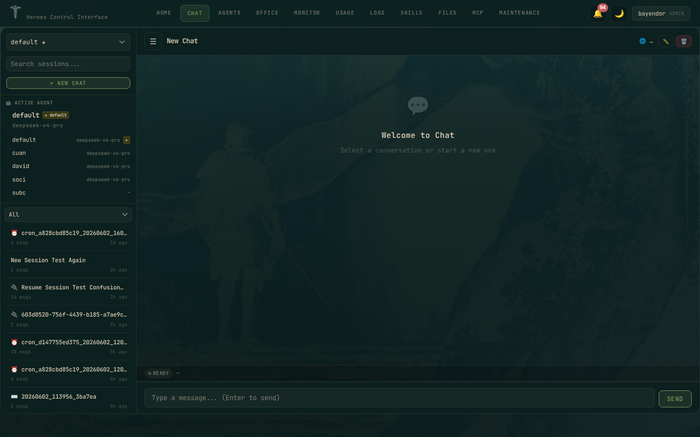

# Hermes Control Interface

A self-hosted web dashboard for the [Hermes AI agent](https://github.com/NousResearch/hermes-agent) stack. Manage terminals, files, sessions, cron jobs, token analytics, multi-agent gateways, and team access — all behind a password gate.

**Stack:** Vanilla JS + Vite · Node.js · Express · WebSocket · xterm.js
**Version:** 3.3.0

---

## Highlights

> **Chat Revamped** — Collapsible tool call cards with JSON viewer, session sidebar with model tags, banner-free output.

> **RBAC v2** — 28 permissions across 12 groups. Admin, viewer, or custom roles per user.

> **Multi-Agent Gateway** — Start/stop/configure multiple Hermes profiles. Real-time logs. Systemd service management.

> **Token Analytics** — Track sessions, messages, tokens, cost by model, platform, and time range.

---

## Screenshots

### Dark Mode

| Home | Agents |
|------|--------|
|  |  |

| Chat (NEW) | Usage & Analytics |
|------------|------------------|
|  |  |

| Skills Hub | Maintenance |
|------------|-------------|
|  |  |

| File Explorer | Agent Dashboard |
|---------------|----------------|
|  |  |

| Agent Gateway | Agent Sessions |
|---------------|----------------|
|  |  |

| Agent Config | Agent Memory |
|---------------|--------------|
|  |  |

| Agent Skills | Agent Cron |
|--------------|------------|
|  |  |

### Light Mode

| Home | Agents | Skills Hub |
|------|--------|------------|
|  |  |  |

| Gateway | Memory |
|---------|--------|
|  |  |

---

## Features

### 🔐 Authentication

- Single password login (configurable via `HERMES_CONTROL_PASSWORD`)
- bcrypt password hashing (cost factor 10)
- CSRF tokens on all mutating requests
- Conditional Secure cookie flag (auto-detects HTTPS)
- Rate limiting: 5 failed logins per 15 minutes per IP
- Multi-user support with role-based access control (RBAC)

---

### 🏠 Home Dashboard

System overview at a glance:
- **System Health**: CPU usage, RAM usage, Disk usage, Uptime
- **Agent Overview**: active model, provider, gateway status, configured API keys, active platforms
- **Gateway Status**: per-profile running/stopped indicators
- **Token Usage (7d)**: sessions count, messages, total tokens, estimated cost, models used, platforms breakdown, top tools

---

### 🤖 Agents — Multi-Agent Management

Manage all Hermes profiles from one place:
- List all profiles with status badge (running/stopped) and active model
- Create new profile
- Clone existing profile
- Delete profile
- Set default profile
- Start/Stop/Restart gateway per profile
- Quick gateway log viewer

---

### 💬 Chat — Revamped Interface

The chat interface got a full overhaul in v3.3.0:

**Tool Call Cards**
- Each tool call displayed as a collapsible card
- Shows tool name, status (running/success/error), and execution time
- Expand to see full JSON input/output
- Collapsed by default for clean output

**Session Sidebar**
- List of past chat sessions with timestamps
- Resume any session with one click
- New chat button for fresh session
- Shows active model tag

**Clean Output**
- Banner suppression (`-Q` flag) for noise-free responses
- Auto-detects both new (`session_id:`) and legacy (`Session:`) session ID formats
- `--continue ""` (empty) creates new session
- Bare `--continue` resumes last session

**Session Management**
- Rename sessions
- Delete sessions
- Export session transcript

---

### 📊 Usage & Analytics — Token Insights

Full breakdown of LLM usage:
- **Time Range**: Today, 7d, 30d, 90d filters
- **Agent Filter**: per-profile or all combined
- **Overview Cards**: total sessions, messages, tokens, cost, active hours
- **Models Table**: per-model breakdown — sessions count, total tokens, avg tokens/session
- **Platforms Table**: per-platform breakdown (CLI, Telegram, WhatsApp, etc.)
- **Top Tools**: most called tools with call counts and success rates

---

### 🛠️ Agent Detail — Per-Agent Management

Six-tab interface for deep agent configuration:

#### Dashboard Tab
- Agent identity: name, model, provider
- Gateway service status
- Quick token usage summary
- Active platforms

#### Sessions Tab
- List all sessions for this profile
- Search by keyword
- Rename session
- Delete session
- Export session (JSON format)
- Resume session in CLI (one click)

#### Gateway Tab
- Start/Stop/Restart gateway service
- Real-time log stream (WebSocket)
- Systemd service management (for non-root users: `hermes-gateway-<profile>`)
- Gateway configuration panel

#### Config Tab
- 13 categories, 80+ settings
- Structured form editor with labeled fields
- Raw YAML editor toggle
- Reset to defaults per category
- Apply changes with validation

#### Memory Tab
- Dynamic memory provider panel
- Provider options: Built-in MEMORY.md, Honcho (self-hosted), External providers
- Honcho status: connected/disconnected
- Memory usage stats

#### Cron Tab
- List all scheduled jobs for this profile
- Create new cron job with schedule presets (hourly, daily, weekly, custom cron expression)
- Pause/Resume scheduled jobs
- Run job immediately (on-demand)
- Edit/Delete cron jobs
- Next run time display

---

### 📦 Skills Marketplace

Browse and manage installed Hermes skills:
- Grouped by category (devops, mlops, creative, etc.)
- Shows skill name, description snippet, source (builtin/local), trust level
- Search and filter skills
- Install new skills from the Hermes skills registry
- Check for updates
- Uninstall skills

---

### 🔧 Maintenance — System Administration

Full admin panel:
- **Doctor**: Run diagnostics — detects common issues, auto-fix where possible
- **Dump**: Generate debug summary (system info, config, recent logs)
- **Update**: Update Hermes agent to latest version
- **Backup**: Download all Hermes data as a zip file
- **Import**: Restore from backup zip
- **HCI Restart**: Restart the Control Interface web server from UI (no SSH needed)
- **Users** (NEW in v3.3.0): Create/edit/delete users, assign roles, manage permissions
- **Auth**: View provider status (OpenRouter, Nous Portal, etc.), add/remove API keys
- **Audit**: Timestampped activity log — who did what and when

---

### 📁 File Explorer

Split-view file editor:
- **Left panel**: Directory tree browser
- **Right panel**: Text editor with syntax highlighting
- **Save**: Write changes back to disk
- **Secure**: Paths scoped to `~/.hermes`, traversal attacks prevented
- **Multiple roots**: Configurable via `HERMES_CONTROL_ROOTS`

---

### 💻 Terminal

Real browser-based terminal:
- Full PTY via node-pty + xterm.js over WebSocket
- Touch-friendly controls (↑↓␣↵) for mobile
- Fullscreen toggle
- Auto-cleanup flow: Ctrl+C → clear → ready for next command
- Rate limited: 30 commands/minute per IP

---

### 🔔 Notifications

- Bell icon with unread count badge (top-right)
- Dropdown panel with notification list
- Dismiss individual or clear all
- Sources: system alerts (disk/RAM/CPU), gateway events, session CRUD, user management
- Persistent: stored in `~/.hermes/hci-notifications.json`

---

### 🎨 Theme

- **Dark mode** (default): `#0b201f` background, `#dccbb5` foreground, `#7c945c` accent
- **Light mode**: `#e4ebdf` background, `#0b201f` foreground, `#2e6fb0` accent
- Toggle via header button
- Preference persisted in localStorage
- Login page: themed background image with overlay

---

### 🔒 Security

- **Multi-user RBAC**: 28 permissions across 12 groups
- **Roles**: `admin` (full access), `viewer` (read-only), `custom` (your choice)
- **bcrypt** password hashing (cost factor 10)
- **CSRF tokens** on all mutating requests
- **Secure cookie** flag (auto-detects HTTPS)
- **WebSocket origin** verification (exact match)
- **Input sanitization**: strict regex on all user inputs (profiles, sessions, titles, filenames)
- **Path traversal prevention** in file explorer
- **Rate limiting**: login (5 failed/15min), terminal exec (30/min)
- **XSS protection**: all dynamic values escaped in rendered HTML
- **Admin gate**: critical endpoints (`/api/plugins`, etc.) require admin role
- **Token cleanup**: automatic session token cleanup every 15 minutes
- **Unhandled exception handlers**: `unhandledRejection` + `uncaughtException` caught and logged

See full security audit: [docs/SECURITY_AUDIT.md](docs/SECURITY_AUDIT.md)

---

## Quick Start

```bash
# Clone
git clone https://github.com/xaspx/hermes-control-interface.git
cd hermes-control-interface

# Install
npm install

# Configure
cp .env.example .env
# Edit .env:
#   HERMES_CONTROL_PASSWORD=your-secure-password
#   HERMES_CONTROL_SECRET=a-random-secret-string

# Build frontend
npm run build

# Start
npm start
```

Access at `http://localhost:10272` (default PORT).

---

## Environment Variables

| Variable | Required | Description |
|---|---|---|
| `HERMES_CONTROL_PASSWORD` | Yes | Login password |
| `HERMES_CONTROL_SECRET` | Yes | CSRF + internal auth secret |
| `PORT` | No | Server port (default: 10272) |
| `HERMES_CONTROL_HOME` | No | Hermes home dir (default: ~/.hermes) |
| `HERMES_CONTROL_ROOTS` | No | File explorer roots (JSON array) |
| `HERMES_PROJECTS_ROOT` | No | Projects directory |

---

## Architecture

```
src/                    # Vite source (ES modules)
├── index.html          # Entry point
├── js/main.js          # App logic (~4800 lines, modular sections)
├── css/
│   ├── theme.css       # Color palette (dark/light)
│   ├── layout.css      # Topbar, modals, dropdowns, sidebar
│   └── components.css  # Cards, tables, forms, editor, file explorer
├── public/
│   └── favicon.svg     # Served unhashed
└── assets/             # SVG icons

dist/                   # Vite build output (served by Express)
server.js               # Express + WebSocket + PTY + API (~2300 lines)
auth.js                 # Multi-user auth + RBAC (bcrypt, sessions, permissions)
```

---

## Development

```bash
# Edit source in src/
npx vite build

# Restart (never in foreground — use detached)
kill $(lsof -t -i:10272) 2>/dev/null
nohup node server.js &>/dev/null & disown
```

---

## API

100+ endpoints covering:
- **Auth**: login, logout, session management, setup
- **Users**: CRUD, role assignment, permission management, reset password
- **Sessions**: list, rename, delete, export, resume
- **Profiles**: list, create, clone, delete, use, gateway control
- **Chat**: send message, stream response, tool calls
- **Cron**: list, create, pause, resume, run, remove
- **Config**: read, write, YAML parsing, reset
- **Memory**: provider-specific panels (MEMORY.md, honcho, external)
- **Skills**: list, parse, search, install, uninstall, check updates
- **Files**: list, read, write, save (scoped to Hermes home)
- **System**: health, insights, usage analytics, doctor, dump, update, backup
- **Notifications**: list, dismiss, clear
- **Plugins**: admin-only plugin management
- **Terminal**: exec command via PTY
- **Audit**: activity log

See `docs/API.md` for full reference.

---

## Security Audit

Full audit report: [docs/SECURITY_AUDIT.md](docs/SECURITY_AUDIT.md)
**Score: 7.0/10** — Production-ready.

Issues found and fixed in v3.3.0:
- XSS in home cards (`loadHomeCards()`) — fixed with `escapeHtml()`
- Missing admin gate on plugins API — fixed
- Terminal exec rate limit — 30 commands/minute per IP
- Token cleanup interval — now runs every 15 minutes

---

## Updating HCI

```bash
# 1. Pull latest code
cd /root/projects/hermes-control-interface
git pull origin main

# 2. Install dependencies (if package.json changed)
npm install

# 3. Rebuild frontend
npm run build

# 4. Restart production server
kill $(lsof -t -i :10272) 2>/dev/null
nohup node server.js &>/dev/null & disown
```

Or use the HCI UI: **Maintenance → HCI Restart** (restarts from browser).

**Non-root users:** Replace `/root/projects` with your user's project directory.
If running via systemd, use `sudo systemctl restart hermes-control`.

---

## Changelog

### v3.3.0 (2026-04-17)

**💬 Chat Revamp:**
- Tool call cards: collapsible cards with JSON viewer, collapsed by default
- Banner suppression: `-Q` flag passed to hermes for clean output
- Session sidebar: model tag, session list, resume/new chat buttons
- Auto-detect session ID format: new (`session_id: YYYYMMDD_HHMMSS_HEX`) and legacy (`Session: YYYYMMDD_HHMMSS_HEX`)
- `--continue ""` (empty) creates fresh session; bare `--continue` resumes last session

**👥 User Management v2 (RBAC):**
- 28 permissions across 12 groups: Sessions, Chat, Logs, Usage, Gateway, Config, Secrets, Skills, Cron, Files, Terminal, Users, System
- Built-in roles: `admin` (full access), `viewer` (read-only), custom role
- Create/edit user modal: role presets (Admin/Viewer), grouped permission checklist, reset password button
- Permission gating on 9 previously-unprotected endpoints

**🔒 Security:**
- Full security audit (docs/SECURITY_AUDIT.md) — score 7.0/10
- XSS fix: `loadHomeCards()` now escapes all dynamic values with `escapeHtml()`
- Rate limiter: terminal exec limited to 30 commands/minute per IP (429 on exceeded)
- Token cleanup: proper `setInterval()` every 15 minutes (was only on token creation)
- Admin-only gate: `GET /api/plugins` now requires admin role
- Full activity audit log: Maintenance → Audit panel

**📦 Skills:**
- Check updates: handles "unavailable" source status gracefully (info message, not error)
- Uninstall: uses stdin pipe (`echo y |`) instead of unsupported `--yes` flag

**🐛 Bug Fixes:**
- Notification dismiss: backend handles both `/api/notifications/:id/dismiss` and `/api/notifications/dismiss`
- Sidebar: responsive CSS, `flex-shrink:0`, mobile breakpoints at 480px
- Agent dropdown: follows dark/light theme correctly
- Favicon 404 loop: moved to `public/` to prevent Vite hash mismatch
- HCI Info panel: version, GitHub link, Twitter @bayendor link in Maintenance

**📝 Docs:**
- Security audit report (12 categories)
- Removed outdated script references (install.sh, reset-password.sh)
- Screenshots: 13 dark mode, 6 light mode

### v3.2.0 (2026-04-14)

**⚡ Performance:**
- Insights speed: 60s+ timeout → 0.65s via IPv4 adapter on model_metadata.py
- Timeouts reduced: 10s → 5s (model metadata), 5s → 3s (llama.cpp props)

**🔒 Security:**
- WebSocket origin: exact match (was substring check)
- Body limit: 10MB → 1MB global, 10MB only on avatar upload
- Temp files: `crypto.randomUUID()` (no predictable paths)
- Skills install/uninstall: `execHermes()` instead of shell interpolation
- Username validation: 2-32 chars, alphanumeric/_.- only

**✨ Features:**
- Log tabs: Agent, Error, and Gateway logs now working
- Non-root user support: dynamic HCI identity, HOME-aware paths
- Gateway service: auto-detect `hermes-gateway-<profile>` for non-root

**🐛 Fixes:**
- Terminal flow: transcript handling after sendCommand
- XSS: 15+ escaped user-facing error messages
- Auth panel: data loaded async, doesn't block page load
- CPR stripping: removed ANSI escape from terminal

### v3.1.0 (2026-04-12)

- Skills Hub + Honcho panel + Gateway connections
- HTTPS support
- Maintenance UI: Backup & Import, HCI Restart buttons

---

## License

MIT

## Credits

Built for the [Hermes Agent](https://github.com/NousResearch/hermes-agent) ecosystem.

[@bayendor](https://x.com/bayendor) — GitHub: [xaspx](https://github.com/xaspx)
